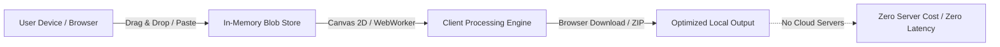

# Everything Image Studio 🎨⚡

> **High-Performance, Purely Client-Side Image Manipulation & Processing Platform**


[](#testing)
[](#privacy--architecture)
[](#tech-stack)

---

## 🌟 Overview

**Everything Image Studio** is a browser-native image editing and optimization suite designed for performance, flexibility, and absolute privacy. Every image is processed directly inside your browser's memory using HTML5 `<canvas>` APIs and multi-threaded Web Workers.

**Zero server uploads. Zero cloud compute. Zero privacy leaks.**

---

## 🚀 Core Features & Modules

### 1. ⚡ The Compressor
- **Perceptual Size Reduction**: Intelligently compresses images using `browser-image-compression`.
- **Dynamic Before & After Estimator**: Real-time side-by-side file size feedback and reduction percentages.
- **Multithreaded Web Workers**: Non-blocking background worker threads ensure ultra-smooth 60fps UI.
- **Interactive Split Slider**: Drag slider to compare compression quality against original image.

### 2. 🔄 The Converter
- **Cross-Format Conversion**: Instant cross-conversion between **JPG**, **PNG**, **WebP**, and **AVIF**.
- **Lossy / Lossless Quality Toggles**: Fine-tuned control over output bitrate.
- **Matte & Background Fill**: Custom background color selector for JPEG transparent conversions.
- **Bulk Batch Converter**: Convert multiple files in parallel.

### 3. 📐 The Resizer
- **Aspect Ratio Locking**: Seamless lock/unlock toggle with proportional dimension calculation.
- **Precision Pixel Inputs**: Custom pixel dimensions for exact width and height specifications.
- **Scale Percentage Presets**: 25%, 50%, 75%, 100%, 150%, 200%, or granular slider scale.
- **Social & Display Presets**:
  - *Instagram Square (1080×1080)*
  - *Instagram Story / Reel (1080×1920)*
  - *Twitter / X Banner (1500×500)*
  - *YouTube HD Thumbnail (1280×720)*
  - *Full HD Display (1920×1080)*
  - *Avatar / Profile (500×500)*

### 4. 🏷️ The Watermarker
- **Custom Text Watermarks**: Custom typography (Sans, Mono, Serif, Impact), font sizing, font weight, and color palette.
- **Logo / Stamp Overlays**: Upload secondary PNG transparent graphics as stamps.
- **9-Point Matrix Positioning**: Instant alignment to Top-Left, Center, Bottom-Right, etc.
- **Tiled Repeat Watermarks**: Diagonal repeating patterns for document and photography copyright protection.
- **Opacity & Rotation**: Variable alpha opacity (0–100%) and angular rotation (-90° to +90°).

### 5. 🎛️ Enhancements & Adjustments
- **Tone Controls**: Granular Brightness, Contrast, and Saturation sliders.
- **Artistic Filters**: Instant Grayscale, Sepia, and Invert filters.
- **Transformations**: 90° clockwise rotation, Horizontal Flip, and Vertical Flip.

### 6. 📦 Batch Processor & JSZip Downloader
- Process multiple uploaded images simultaneously with active tool presets.
- Real-time progress bar with file-by-file tracking.
- One-click ZIP generation and download via `JSZip` and `file-saver`.
- Confetti celebratory animations on export.

### 7. 📥 Universal Drag & Drop & Clipboard Paste
- Drag-and-drop images anywhere onto the window.
- Global `Ctrl + V` clipboard listener to paste screenshots directly from your clipboard.
- Preloaded high-resolution sample images for instant evaluation.

---

## 🛠️ Tech Stack

- **Framework:** [React 19](https://react.dev/) + [TypeScript](https://www.typescriptlang.org/)
- **Bundler:** [Vite](https://vitejs.dev/)
- **Styling:** [Tailwind CSS](https://tailwindcss.com/) (Dark-mode modern glassmorphism UI)
- **Icons:** [Lucide React](https://lucide.dev/)
- **Compression & Processing:** `browser-image-compression` + HTML5 Canvas 2D Context API
- **Batch Export:** `jszip` + `file-saver`
- **Testing:** [Vitest](https://vitest.dev/) + [React Testing Library](https://testing-library.com/)

---

## 🧪 Testing Protocol

The codebase is tested across unit utilities and component interactions with **100% test pass rate**:

```bash
# Run test suite
npm run test

# Run tests in watch mode
npm run test:watch
```

### Test Suites Included:
- `imageUtils.test.ts`: 26 pure unit tests covering formatting, byte calculations, aspect ratios, watermark coordinate placement, CSS filter chaining, sample image generation, and ZIP serialization.
- `components.test.tsx`: 11 component test suites covering Navbar, Toolbar, DropZone, Compressor, Converter, Resizer, Watermarker, Adjustments, Batch Export Modal, and Preview Canvas.

---

## 💻 Local Setup & Development

### Prerequisites
- Node.js 18+ or Node.js 22+
- npm 9+ or pnpm / yarn

### Installation

```bash
# 1. Clone the repository
git clone https://github.com/abhieee-java/everything-image-studio.git
cd everything-image-studio

# 2. Install dependencies
npm install

# 3. Start development server
npm run dev

# 4. Production build
npm run build
```

---

## 🔒 Privacy & Architecture



All images remain entirely in browser RAM using Object URLs and Blob streams. No data is ever transmitted to an external server.

---

## 📄 License

MIT License © 2026 ABHIIEEE. Free and open source for personal and commercial use.
