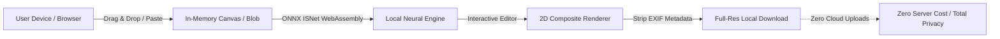

# PureCut AI — World-Class Client-Side Background Remover ✂️⚡

> **«No Upload. No Limit. No Watermark. Full Quality.»**  
> Remove backgrounds instantly, privately, and at full resolution. Everything happens directly on your device.


[](#testing)
[](#privacy--architecture)
[](#tech-stack)

---

## 🌟 Primary Product Promise

PureCut AI delivers production-grade, flagship background removal without the predatory tricks of cloud tools:

- 🔒 **100% Client-Side Processing**: Neural networks run locally inside your browser via WebAssembly & WebGPU. Zero bytes leave your device.
- ⚡ **Zero Latency**: No waiting for server queues or file uploads.
- 💎 **Full Native Resolution**: Preserves full 4K, 8K, and high-megapixel dimensions without artificial downscaling.
- 🆓 **Completely Free & Unlimited**: No paywalls, no forced signups, no artificial credit systems.
- ✨ **No Watermark**: Clean, professional exports for personal and commercial projects.
- 🛡️ **EXIF Metadata Privacy Shield**: Automatically strips embedded GPS locations and camera serial numbers before download.

---

## 🚀 Core Modules & Features

### 1. ✂️ The Background Remover (Flagship)
- **Neural ISNet Architecture**: High-accuracy salient object detection running directly in the browser via Web Workers.
- **Smart AI Modes**:
  - *Auto*: General-purpose high-accuracy neural segmentation.
  - *Portrait*: Soft alpha feathering optimized for human hair and fine edges.
  - *Product*: Crisp, high-contrast outlines for e-commerce catalog objects.
  - *Hair & Fur*: Sub-pixel boundary refinement for complex contours.
- **Dynamic Laser Scanline Experience**: Beautiful holographic scanning beam visualizing subject segmentation in real time.
- **Interactive Split Slider**: Draggable comparison divider with mouse, touch gesture, and keyboard arrow controls.
- **View Modes**: Split Slider, Side-by-Side, Processed Cutout, and Original Image.
- **Checkerboard Transparency**: High-contrast dark & light checkerboard pattern with explicit «Transparent» indicator.

### 2. 🎨 Studio Background Replacement
- **Transparent**: Pure 32-bit alpha PNG output.
- **Solid Colors**: Instant white, black, neutral studio gray, vibrant accent presets, plus a full RGB hex color picker.
- **Gradients**: Electric Studio, Sunset Glow, Ocean Mist, Cyber Neon, Soft Minimal, and Midnight Deep presets.
- **Blur Original**: Real-time Gaussian blur slider (2–40px) blurring the background scenery behind the subject.
- **Custom Image**: Upload any replacement background graphic (studio backdrop, landscape, texture).

### 3. 🖌️ Edge Refinement (Interactive Brush)
- **Erase (E)**: Mask out background remnants with sub-pixel feathering.
- **Restore (R)**: Paint back parts of the original image with brush opacity control.
- **Brush Controls**: Granular size slider (5–100px) and hardness/feather slider (10–100%) with a live circular cursor preview.
- **Undo / Redo Stack**: 20-level history stack via `Ctrl + Z` / `Ctrl + Shift + Z` and on-screen buttons.

### 4. 📐 Smart Crop & Social Presets
- **Auto Crop**: Alpha-channel subject bounds detection with *Tight (5% padding)*, *Balanced (15% padding)*, and *Canvas* modes.
- **Aspect Presets**:
  - *E-Commerce (1:1)*: Clean white studio background + balanced subject padding.
  - *Square (1:1)*: Instagram posts.
  - *Portrait (4:5)*: Social feeds.
  - *Story (9:16)*: Reels, Stories, TikTok.
  - *Banner (16:9)*: YouTube thumbnails.
  - *Avatar Circle*: Circular-masked profile pictures.
- **Transforms**: 90° clockwise rotation, Horizontal Flip, Vertical Flip.

### 5. 📦 Batch Processing
- Select or drop up to 10–20 images simultaneously.
- Thumbnail status queue with real-time progress indicators.
- One-click client-side ZIP generation with `JSZip`.

### 6. 🗄️ IndexedDB Local History
- Saves recent edits safely in browser memory (last 10 items).
- Retrieve, reload into the workspace, or delete with zero server communication.
- "Clear History" button for immediate wipe.

### 7. ⚡ Image Studio Suite (Companion Tools)
- **The Compressor**: Perceptual size reduction with real-time before/after byte savings.
- **The Converter**: High-speed cross-format conversion between JPG, PNG, WebP, and AVIF.
- **The Resizer**: Aspect-ratio lock with custom dimensions and scaling percentages.
- **The Watermarker**: Custom text & logo overlays with 9-point grid alignment and tiled repeat patterns.
- **Enhance & Adjust**: Tone sliders (Brightness, Contrast, Saturation) and artistic filters.

---

## ⌨️ Keyboard Shortcuts

| Shortcut | Action |
| --- | --- |
| `U` | Open image upload dialog |
| `E` | Switch to Erase brush |
| `R` | Switch to Restore brush |
| `B` | Toggle Before/After comparison view |
| `Z` | Toggle Zoom (Fit / 100%) |
| `Ctrl + Z` | Undo edge brush stroke |
| `Ctrl + Shift + Z` | Redo edge brush stroke |
| `←` / `→` | Adjust comparison slider divider |
| `Esc` | Close drawers and modal dialogs |
| `?` | Show Keyboard Shortcuts panel |

---

## 🔒 Privacy & Architecture Guarantee



---

## 🛠️ Tech Stack

- **Framework:** [React 19](https://react.dev/) + [TypeScript](https://www.typescriptlang.org/)
- **Bundler:** [Vite 8](https://vitejs.dev/) + Rolldown
- **Styling:** [Tailwind CSS](https://tailwindcss.com/)
- **Icons:** [Lucide React](https://lucide.dev/)
- **AI Runtime:** `@imgly/background-removal` (ISNet ONNX WebAssembly & WebGPU)
- **Local Storage:** HTML5 Canvas, Web Workers, IndexedDB, Cache API
- **Testing:** [Vitest](https://vitest.dev/) + [React Testing Library](https://testing-library.com/)

---

## 🧪 Testing & Verification

Run the full automated test suite:

```bash
# Run tests
npm run test

# Build for production
npm run build
```

---

## 💻 Local Setup

```bash
# 1. Clone repository
git clone https://github.com/abhieee-java/everything-image-studio.git
cd everything-image-studio

# 2. Install dependencies
npm install

# 3. Start development server
npm run dev

# 4. Preview production build
npm run preview
```

---

## 📄 License

MIT License © 2026. Free and open source for personal and commercial use.
